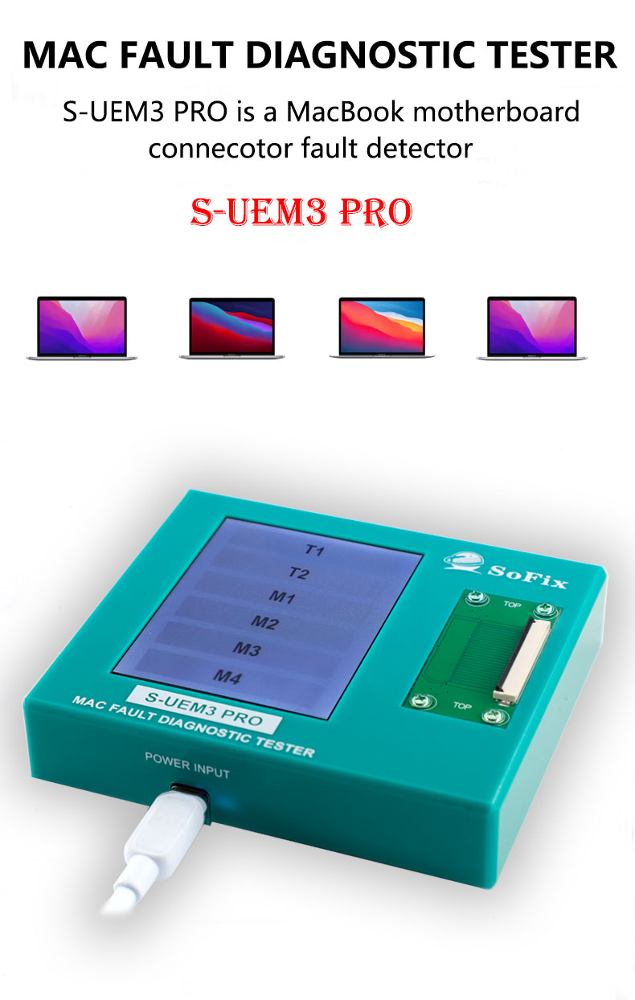

# S-UEM3 PRO — MacBook Fault Diagnostic Tester

> Official product landing page for the **S-UEM3 PRO** by SoFix — a professional MacBook motherboard connector fault detector for logic board repair technicians.



---

## 🔗 Live Page

**[https://itslh1024.github.io/s-uem3-pro](https://itslh1024.github.io/s-uem3-pro)**

---

## 📦 Product Overview

The S-UEM3 PRO is a MacBook motherboard connector fault detector that covers **2016–2025 MacBook Air and MacBook Pro** models — Intel T1/T2 and Apple Silicon M1, M2, M3, and M4.

| Feature | Detail |
|---|---|
| Power | 5V via Type-C |
| Display | LED Touchscreen |
| Coverage | 2016–2025 MacBook |
| Chips | T1, T2, M1, M2, M3, M4 |
| Kit includes | 1 Host + 5 Cables + 1 Conversion Board |
| Dimensions | 107 × 92 × 23 mm |
| Weight | 303 g |

### Core Functions
- **USB-C Boost Fault** — detects faults in the 5V–20V power delivery path
- **No-Display / Camera Fault** — diagnoses via EDP display connector (38-pin & 48-pin)
- **Backlight Fault** — locates faults via JP900 connector
- **Pre-loaded Reference Values** — normal connector values for all supported models factory-written inside
- **3-State Readout** — explicitly displays HIGH / LOW / SHORT CIRCUIT

---

## 🗂 Repo Contents

```
/
├── index.html        # Landing page (single file, embedded CSS & JS)
├── 1_01.jpg          # Hero — device main shot
├── 1_02.jpg          # Features section
├── 1_04.jpg          # Smart design / cables
├── 1_06.jpg          # Compatibility — MacBook lineup
├── 1_07.jpg          # What's in the box — cables
├── 1_08.jpg          # What's in the box — conversion board
├── 1_09.jpg          # What's in the box — full kit
├── README.md
└── LICENSE
```

---

## 💼 Wholesale & Sales

For bulk orders, dealer pricing, or distributor inquiries — contact via the CTA on the live page.

---

© 2025 itslh1024 (Lucy). All Rights Reserved. See [LICENSE](LICENSE).
